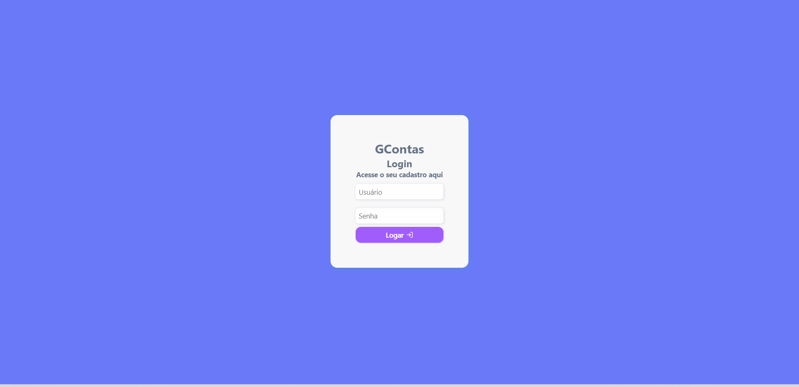

# Gconta 



## Introdução


<p align='left'>
O Gconta é um projeto desenvolvido para armazenar dados de login de usuários em um sistema de forma segura. Utilizando tecnologias como Node.js, TypeScript, NestJS, Prisma ORM e PostgreSQL, o Gconta oferece uma solução confiável para armazenamento e gerenciamento de informações de login.
</p>


## Tecnologias utilizadas

[](https://skillicons.dev)

- Node.js
- TypeScript
- NestJS
- Prisma ORM
- PostgreSQL
- React
- Styled-componets
- React-query
- React-hook-form
- Vite

## Como instalar

Claro, aqui está a lista de tarefas para o seu projeto usando o NestJS (Node.js) no backend e o frontend em uma pasta separada:

**Backend:**

1. Entrar na pasta do backend:
   ```
   cd backend
   ```

2. Instalar as dependências do Node.js:
   ```
   npm install
   ```

3. Instalar o Prisma (caso ainda não esteja instalado):
   ```
   npm install prisma --save-dev
   ```

4. Configurar o arquivo `.env` para as configurações do banco de dados (se necessário).

5. Criar e aplicar as migrações do banco de dados usando o Prisma:
   ```
   npx prisma migrate dev
   ```

6. Iniciar o servidor em modo de desenvolvimento:
   ```
   npm run start:dev
   ```

**Frontend:**

1. Entrar na pasta do frontend:
   ```
   cd frontend
   ```

2. Instalar as dependências do Node.js:
   ```
   npm install
   ```

3. Iniciar o servidor de desenvolvimento do frontend:
   ```
   npm run dev
   ```

Lembre-se de configurar adequadamente as variáveis de ambiente e os arquivos de configuração necessários para o NestJS e o Prisma, de acordo com as necessidades do seu projeto. Certifique-se também de que as portas utilizadas pelo backend e pelo frontend não entrem em conflito.

## Como usar

1. Certifique-se de que o banco de dados PostgreSQL está configurado e em execução.
2. No terminal, navegue até o diretório raiz do projeto.
3. Execute o seguinte comando para iniciar o servidor:

```bash
npm run start:dev
```

4. O servidor NestJS será iniciado e estará ouvindo as requisições na porta definida.
5. Use as rotas e endpoints disponibilizados pelo servidor para criar, armazenar e gerenciar as informações de login dos usuários.

## Criador do projeto

O Gconta foi criado por João Guilherme, um desenvolvedor de software apaixonado por segurança e privacidade. O projeto foi desenvolvido com o objetivo de fornecer uma solução confiável e escalável para o armazenamento de dados de login de usuários.


 <sub><b>Joao Guilherme</b></sub></h4> <a href="https://github.com/JoaoG23/">🚀</a>


Done with 🤭 by Joao Guilherme 👋🏽 Entre em contato logo abaixo!

[](https://www.linkedin.com/in/joaog123/)
[](mailto:joaoguilherme94@live.com)


## Licença

[](./LICENSE)
